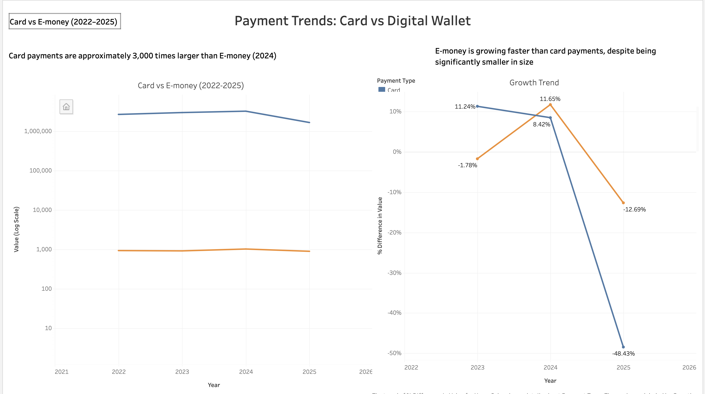

# 📊 Payment Trends Analysis: Card vs Digital Wallet

## Table of Contents

- [Executive Summary](#executive-summary)
- [Methodology](#methodology)
- [Business Problem](#business-problem)
- [Dataset](#dataset)
- [Data Cleaning & Preparation](#data-cleaning--preparation)
- [Dashboard](#dashboard)
- [Key Insights](#key-insights)
- [Growth Analysis](#growth-analysis)
- [Business Recommendations](#business-recommendations)
- [Tools Used](#tools-used)
  
  
## 🔎 Executive Summary
This project analyzes payment trends between traditional card payments and digital wallets (E-money), highlighting differences in scale and growth to assess potential future disruption in the payments industry.

---

##  Methodology
- Collected payment data from ECB datasets
- Cleaned and aggregated yearly transaction values using Python (pandas)
- Transformed data into long format for Tableau analysis
- Created calculated fields (Growth %) for trend comparison
- Built an interactive dashboard in Tableau

---

## 🎯 Business Problem
Financial institutions need to understand:
- Are digital wallets replacing card payments?
- Which payment type is growing faster?
- Is there a long-term risk to card revenue?

---

## 📁 Dataset

**Source:** European Central Bank (ECB)

Data available at:  
https://www.ecb.europa.eu/stats/payment_statistics

Multiple datasets were combined and cleaned for analysis, including:
- Card payments  
- E-money transactions  
- Credit transfers  
- Total payments  

### Final Dataset Includes:
- Year  
- Payment Type (Card, E-money)  
- Transaction Value  

---

## 🧹 Data Cleaning & Preparation
- Extracted year from time data
- Filtered relevant payment types
- Aggregated yearly totals
- Converted data into long format
- Created Growth % (Year-over-Year)

---

## 📊 Dashboard

---

## 💡 Key Insights
- Card payments dominate transaction volume, remaining ~3,000x larger than e-money in 2024
- E-money is experiencing faster growth, indicating increasing digital adoption
- Card payment volume declined sharply in 2025, signaling potential volatility
- Digital wallets are expanding but have not yet disrupted traditional card dominance

---

## 📈 Growth Analysis
- E-money shows stronger positive growth trends
- Card payments show volatility and decline in 2025

---

## 🧠 Business Recommendations
- Monitor digital wallet growth closely
- Invest in digital payment solutions
- Maintain card infrastructure while adapting
- Investigate the drop in card payments (2025)

---

## 🛠 Tools Used
- Python (pandas)
- Tableau
- CSV / Excel

